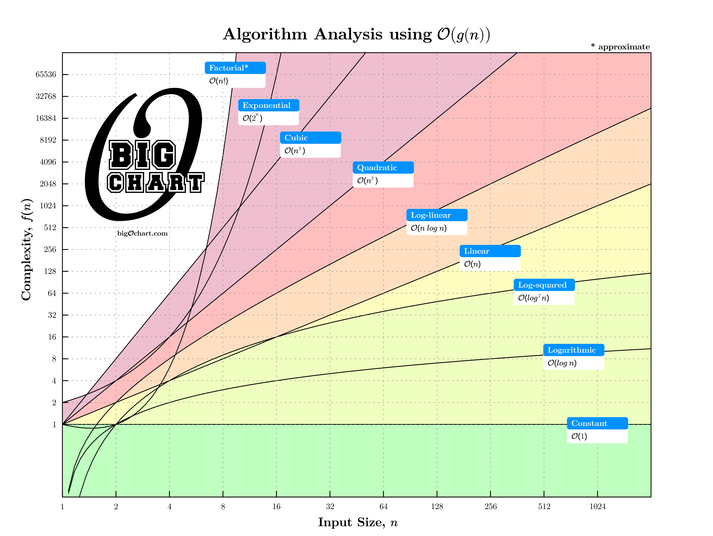
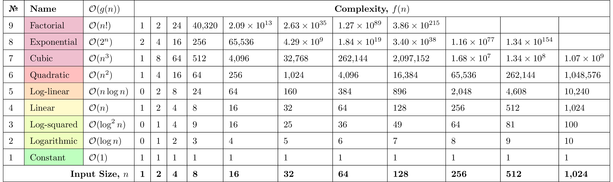

<h1 align="center">
  Algorithm Analysis 
  with Big-O notation
</h1>

  

  Figure 1: $\mathcal{O}$-notation, a.k.a. "Big-O", is used to express the asymptotic upper bound 
        on $f(n)$ by some constant multiple of $g(n)$, written as $f(n) = \mathcal{O}(g(n))$. This 
        upper bound represents the growth of the worst case running time or space consumption 
        and makes no claims regarding tightness of fit. The shaded area underneath each 
        function depicts the absence of an asymptotic lower bound associated with 
        $\mathcal{O}$-notation. See Table 1 for a partial numerical analysis.

 

  

 

  Table 1: Growth rates for algorithms with common complexities.

<h4>Website: <a href="https://bigochart.com">https://bigochart.com</a></h4>
